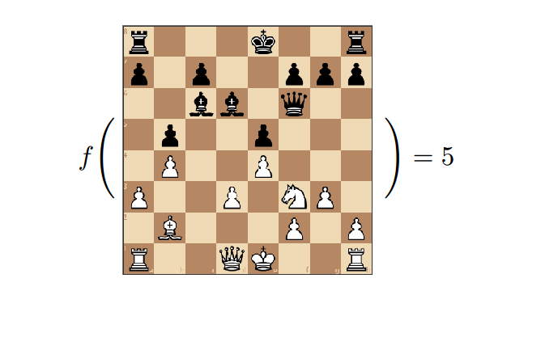
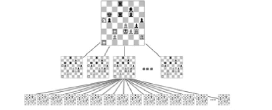
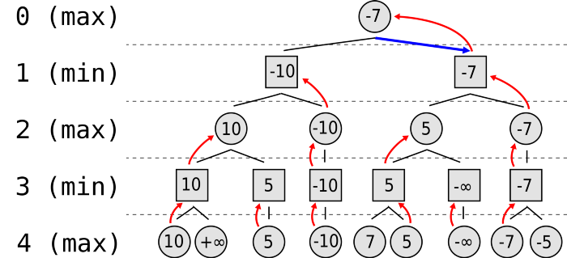
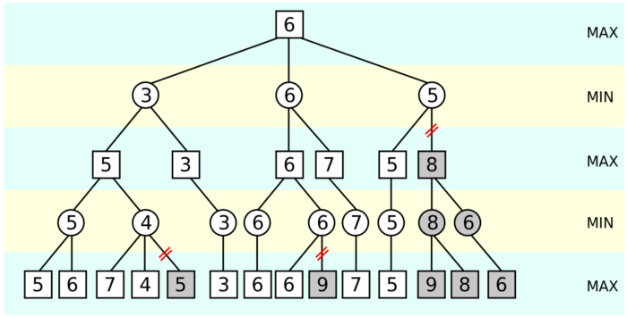

[![Contributors][contributors-shield]][contributors-url]
[![Forks][forks-shield]][forks-url]
[![Stargazers][stars-shield]][stars-url]
[![Issues][issues-shield]][issues-url]
[![MIT License][license-shield]][license-url]
[![LinkedIn][linkedin-shield]][linkedin-url]

`chess-ai` is a simple chess AI in JavaScript. 

<!-- PROJECT LOGO -->
 

  

  <h3 align="center">chess-ai</h3>

  

    `chess-ai` is a simple chess AI in JavaScript. 
     
     
    <a href="https://github.com/shie-ld/chess-ai/issues">Report Bug</a>
    ·
    <a href="https://github.com/shie-ld/chess-ai/issues">Request Feature</a>
  

<!-- TABLE OF CONTENTS -->
## Table of Contents

* [About the Project](#about-the-project)
* [How To Play?](#how-to-play?)
* [Documentation](#documentation)
	* [First Things First](#first-things-first)
	* [Evaluation Function](#evaluation-function)
	* [A Zero-Sum Game](#a-zero-sum-game)
	* [A Simple Example](#a-simple-example)
	* [Game Tree](#game-tree)
	* [Minimizing Losses](#minimizing-losses)
	* [The Algorithm](#the-algorithm)
	* [Alpha-beta Pruning](#alpha-beta-pruning)
* [Roadmap](#roadmap)
* [Contributing](#contributing)
* [License](#license)
* [Contact](#contact)
* [Acknowledgements](#acknowledgements)

<!-- ABOUT THE PROJECT -->
## About The Project

`chess-ai` is a  Simple Chess-AI using `Minimax Algorithm`. Minimax is a kind of backtracking algorithm that is used in decision making and game theory to find the optimal move for a player, assuming that your opponent also plays optimally. It is widely used in two player turn-based games such as Tic-Tac-Toe, Chess, etc

In Minimax the two players are called `maximizer` and `minimizer`. The maximizer tries to get the highest score possible while the minimizer tries to do the opposite and get the lowest score possible. It is because in two player board games, if one player is winning , then the other player must be losing. So `one’s profit` is directly related to `another's loss`.

Every board state has a value associated with it. In a given state if the maximizer has upper hand then, the score of the board will tend to be some positive value. If the minimizer has the upper hand in that board state then it will tend to be some negative value. The values of the board are calculated by some heuristics which are unique for every type of game.

Since this is a `backtracking based algorithm`, it tries all possible moves, then backtracks and makes a decision. 

<!-- GETTING STARTED -->
## How to Play?
1. Clone this repository as `git clone https://github.com/shie-ld/chess-ai.git`.

2. Change to the required directory by typing `cd chess-ai` in your terminal.

3. Start a python http server on your local machine on port `8080` as `sudo python3 -m http.server 8080`.

4. Now, head to your browser and type `localhost:8080` in your search bar. 

5. Play as white by dragging a piece to your desired location. The AI plays as black. The AI's minimax search depth (which is directly related to how well it will play) can be customised using the 'Search Depth (Black)' dropdown. Using a higher value will improve the AI's accuracy, but it will take longer to decide on the next move.

6. To pit the AI against itself, click the 'Start Game' button under Computer vs. Computer. You can stop the game at any time using the 'Stop and Reset' button.

<!-- DOCUMENTATION -->
## Documentation

### First Things First

Getting the `GUI` and `game mechanics` out of the way. This allows us to direct our focus towards only the most fascinating aspect of the application: the `decision-making (AI)` part! For this, we will be using external libraries:

1. `chessboard.js` handles the graphical interface, i.e. the chess board itself.

2. `chess.js` handles the game mechanics, such as move generation / validation.

### Evaluation Function

Now we have a functioning chessboard. But how do we implement an `AI` that plays (reasonably) good chess? Well, we’re going to need an `evaluation function`. Basically, we want to assign a `score` to each `chessboard instance` (i.e. each set of positions of pieces on the board) so that our AI can make decisions on which positions are more favourable than other positions.

### A Zero-Sum Game

Chess is a `zero-sum game`. Any advantages gained by Player A implies disadvantages for Player B. Advantages can come in the form of capturing opponent pieces, or having pieces in favourable positions.

Therefore, when assigning a score from our `AI’s` perspective, a positive score implies an overall advantage for our AI and disadvantage for its opponent, while a negative score implies an overall disadvantage for our AI and advantage for its opponent.

### A Simple Example

For instance, the score for the starting position is `0`, indicating that neither side has an advantage yet. Later on into the game, we are faced with a decision between two moves: `Move A` and `Move B`. Let’s say `Move A` captures a queen, putting our score at `900`, while `Move B` captures a pawn, putting our score at `100`.

The `AI` will be able to compare between the two potential scenarios, and decide that `Move A` is the better move. Of course, this does not consider future ramifications — what if `Move A` gives our opponent the opportunity to attack? We will overcome this hurdle in the following sections by performing lookahead to anticipate subsequent moves.

### Game Tree

We can represent chessboard positions as nodes in a `game tree`. Each node is a chessboard instance, and has `children` corresponding to the possible moves that can be taken from the `parent` node.

### Minimizing Losses

Essentially, minimax aims to minimize the possible losses, assuming both players are rational decision makers. We can represent the possible moves as a game tree, where each layer alternates between the maximizing and minimizing player. We are the maximizing player, attempting to maximize our score, while the opponent is the minimizing player, attempting to minimize our score.

At the leaf nodes, the evaluated score is backtracked. Positive and negative infinity are wins and losses respectively. At each recursive layer, the maximizing and minimizing roles are alternated. Layer `0` is the current game state, and the goal is to maximize our score.

### The Algorithm

1. We decide on a predetermined depth limit, `k`.

2. At Layer `0`, we consider each of our possible moves, i.e. child nodes.

3. For each child node, we consider the minimum score that our opponent can force us to receive. Then, we choose the maximum node.

4. But to know the minimum score that our opponent can force us to receive, we must go to Layer `1`. For each node in Layer `1`, we consider their child nodes.

5. For each child node (possible move by our opponent), we consider the maximum score that we can achieve subsequently. Then, the minimum score that our opponent can force us to receive is the minimum node.

6. But to know the maximum score that we can achieve subsequently, we must go to Layer `2`.

7. And so on.

8. At Layer `k`, the final board state is evaluated and backtracked to Layer `k - 1`, and this continues until we reach Layer `0`, at which point we can finally answer: “What is the optimal move at this point?”

### Alpha-beta Pruning

The algorithm maintains two values, `alpha` and `beta`, which respectively represent the `minimum score` that the `maximizing player` is assured of and the `maximum score` that the `minimizing player` is assured of. 

Initially, `alpha` is `negative infinity` and `beta` is `positive infinity`, i.e. both players start with their worst possible score. Whenever the maximum score that the minimizing player (i.e. the "beta" player) is assured of becomes less than the minimum score that the maximizing player (i.e., the "alpha" player) is assured of (i.e. beta < alpha), the maximizing player need not consider further descendants of this node, as they will never be reached in the actual play.

To illustrate this with a real-life example, suppose somebody is playing chess, and it is their turn. Move "A" will improve the player's position. The player continues to look for moves to make sure a better one hasn't been missed. Move "B" is also a good move, but the player then realizes that it will allow the opponent to force checkmate in two moves. Thus, other outcomes from playing move B no longer need to be considered since the opponent can force a win. The maximum score that the opponent could force after move "B" is negative infinity: a loss for the player. This is less than the minimum position that was previously found; move "A" does not result in a forced loss in two moves.

<!-- ROADMAP -->
## Roadmap

See the [open issues](https://github.com/shie-ld/chess-ai/issues) for a list of proposed features (and known issues).

<!-- CONTRIBUTING -->
## Contributing

Contributions are what make the open source community such an amazing place to be learn, inspire, and create. Any contributions you make are **greatly appreciated**.

1. Fork the Project
2. Create your Feature Branch (`git checkout -b feature/AmazingFeature`)
3. Commit your Changes (`git commit -m 'Add some AmazingFeature'`)
4. Push to the Branch (`git push origin feature/AmazingFeature`)
5. Open a Pull Request

<!-- LICENSE -->
## License

Distributed under the MIT License. See `LICENSE` for more information.

<!-- CONTACT -->
## Contact

dixitrdreshofficial@gmail.com

Project Link: [https://github.com/shie-ld/chess-ai](https://github.com/shie-ld/chess-ai)

<!-- MARKDOWN LINKS & IMAGES -->
<!-- https://www.markdownguide.org/basic-syntax/#reference-style-links -->
[contributors-shield]: https://img.shields.io/github/contributors/shie-ld/chess-ai.svg?style=flat-square
[contributors-url]: https://github.com/shie-ld/chess-ai/graphs/contributors
[forks-shield]: https://img.shields.io/github/forks/shie-ld/chess-ai.svg?style=flat-square
[forks-url]: https://github.com/shie-ld/chess-ai/network/members
[stars-shield]: https://img.shields.io/github/stars/shie-ld/chess-ai.svg?style=flat-square
[stars-url]: https://github.com/shie-ld/chess-ai/stargazers
[issues-shield]: https://img.shields.io/github/issues/shie-ld/chess-ai.svg?style=flat-square
[issues-url]: https://github.com/shie-ld/chess-ai/issues
[license-shield]: https://img.shields.io/github/license/shie-ld/chess-ai.svg?style=flat-square
[license-url]: https://github.com/shie-ld/chess-ai/blob/master/LICENSE.txt
[linkedin-shield]: https://img.shields.io/badge/-LinkedIn-black.svg?style=flat-square&logo=linkedin&colorB=555
[linkedin-url]: https://linkedin.com/in/rudresh-dixit-11a15618a/

